# Lisa voice assistant

## 1. Introduction

###### This is a Android app which integrated multiple voice recognition engine. Such as Baidu, iFlytek, AISpeech solution.We have already integrated Baidu ASR&TTS, iFlytek TTS, AISpeech TTS in application. We plan to still integrate iFlytek & AISpeech ASR in future.

### 1.1 SDK Version:

| SDK Type           | Version |
|:-------------------|:--------|
| Mini SDK Version   | 16      |
| Target SDK Version | 28      |

## 2. How to set up?

### Step 1: Request Baidu development account

1. Access Baidu AI platform website: https://ai.baidu.com/
 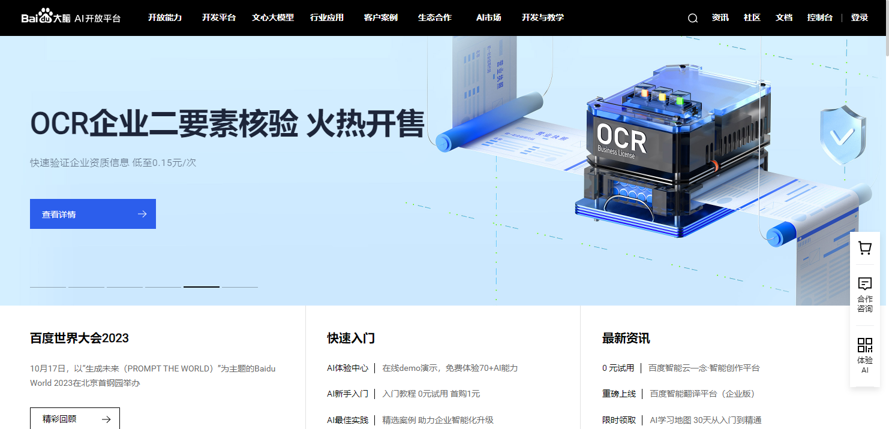 
2. Register Baidu developer account and login.
3. Entry the contry panel.
  
4. Entry the following sub menu:“语音技术”
 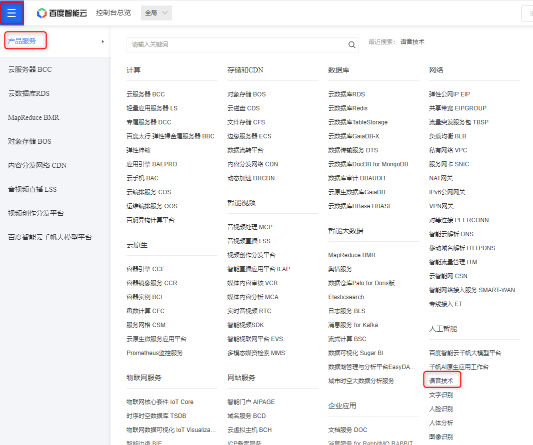 
5. Choose “应用列表”
 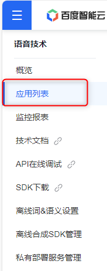 
6. Create application: fill in the data, Please make sure the package name is same with your application.Please choose all options in "语音技术" and "自然语言处理".
 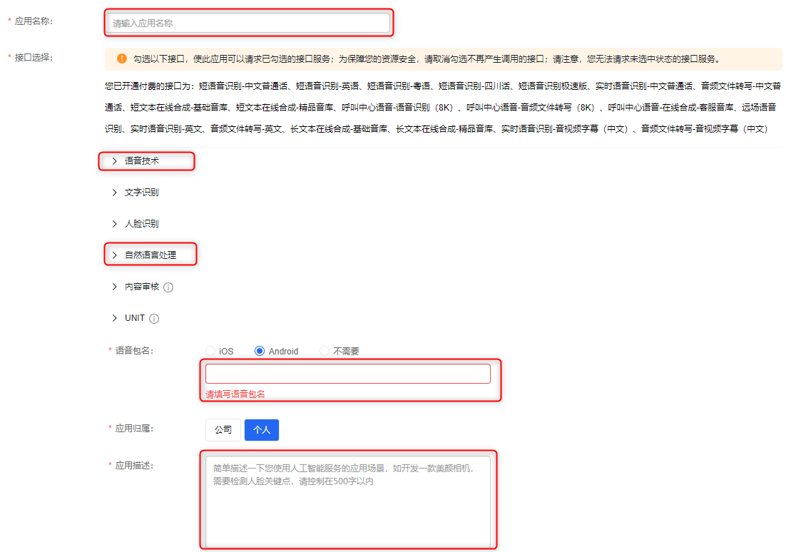 
7. Back to application list you will see the application which you created.
 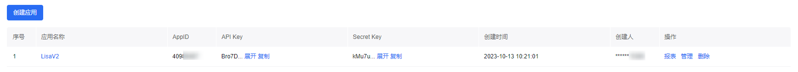 
8. Copy the AppID,APIKey,SecretKey to: \Lisa\app\src\main\assets\Config.properties
 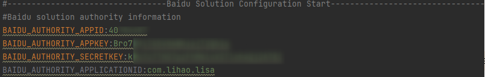 
9. If need to use offline TTS, Need to genarate SN number based on the following steps:
10. Choose "离线合成SDK管理" and find your created application then download the sn number.
 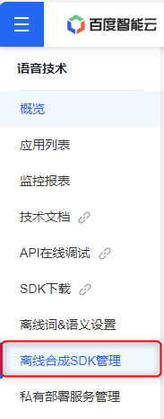 
 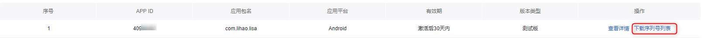 
11. Copy the sn number to: \Lisa\app\src\main\assets\Config.properties
  
12. Rebuild the apk and try if it works.

### Step 2: Request iFlytek development account
- Current version only integrated iFlytek TTS. Will integrate iFlytek ASR in future.
- If you only want to try Baidu solution, You can skip this step. But iFlytek feature will not available.
1. Access iFlytek AI platform website: https://www.xfyun.cn/
2. Register iFlytek developer account.
3. Pres the control panel "控制台".
 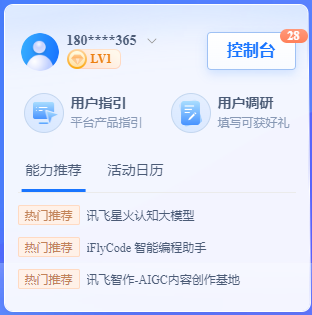 
4. Press "创建新应用" and create the application.
 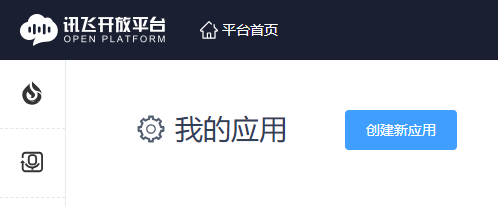 
 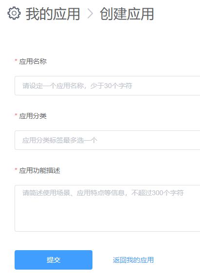 
5. Copy the app id and past to 'IFLYTEK_AUTHORITY_APPID' in \Lisa\app\src\main\assets\Config.properties
 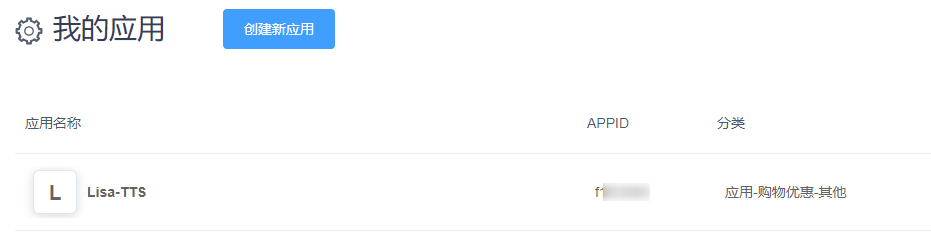 
6. Download SDK in page: https://www.xfyun.cn/sdk/dispatcher
7. Choose your created app name and os type. Choose feature which you needed.
 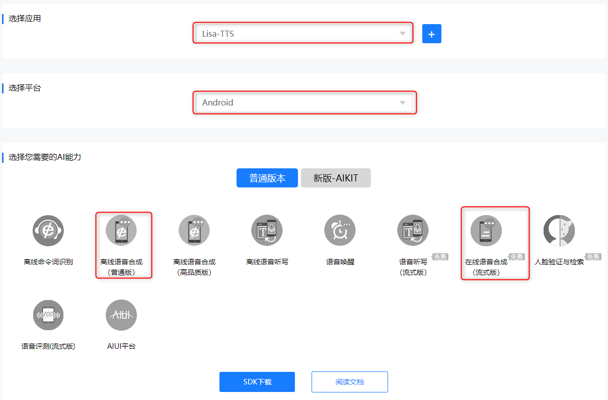 
8. Change name of 'Msc.jar' in SDK to 'com.iflytek.jar' and replace the jar file
Android_xtts_exp1145_f1f23085\libs\Msc.jar ----> \Lisa\app\src\main\java\com\lihao\lisa\model\core\iFlytek\libs\com.iflytek.jar
9. Replace JNI lib:
 Android_xtts_exp1145_f1f23085\libs ----> \Lisa\Lisa\app\src\main\java\com\lihao\lisa\model\core\iFlytek\jniLibs\tts
 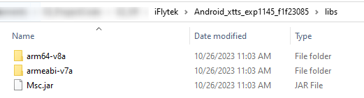 
10. Replace TTS resource file.
Android_xtts_exp1145_f1f23085\res\xtts ----> Android_xtts_exp1145_f1f23085\res\xtts ----> \Lisa\Lisa\app\src\main\java\com\lihao\lisa\model\core\iFlytek\assets\xtts-> \Lisa\Lisa\app\src\main\java\com\lihao\lisa\model\core\iFlytek\assets\xtts
11. The iFlytek add some authority information in SDK lib and So lib directly.So, You have to replace the jar&So lib with it in the SDK.
12. Rebuild the apk and try if it works.

### Step 3: Request AISpeech development account
- Current version only integrated AISpeech TTS. Will integrate AISpeech ASR in future.
- If you only want to try Baidu solution, You can skip this step. But AISpeech feature will not available.
1. Access AISpeech platform website: https://www.duiopen.com/
 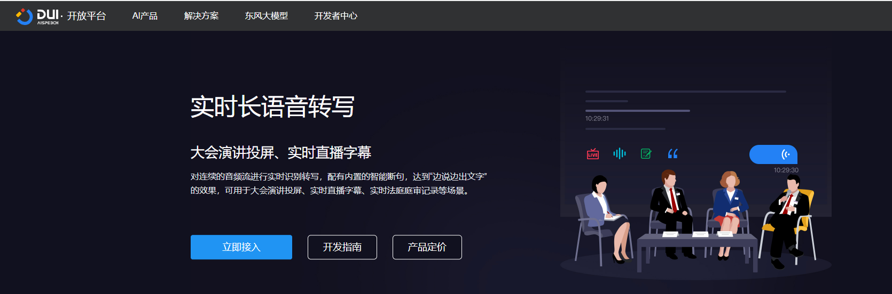 
2. Register AISpeech developer account.
3. Press the control panel "控制台".
4. Press "产品接入".
 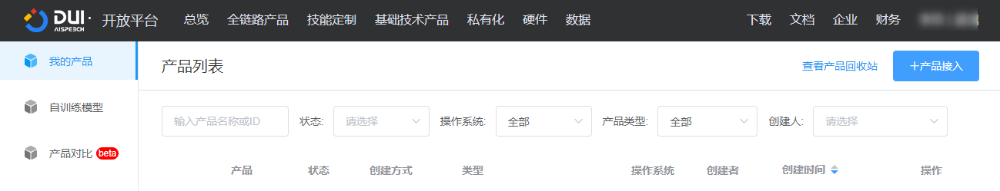 
5. Fill in the name and description.
 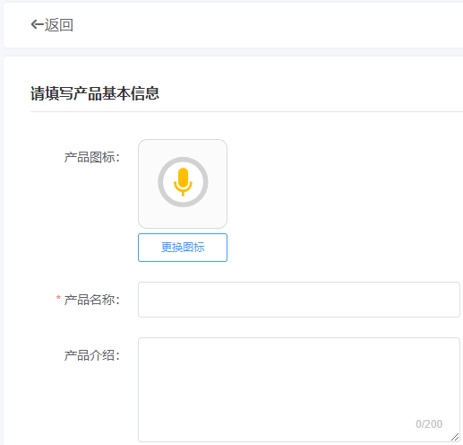 
6. Back to product list and press "查看" of your created product.
 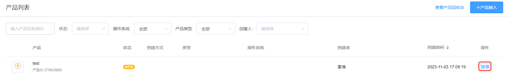 
7. Press "立即开发" and choose "自定义", "全链路技术" and "Android".
 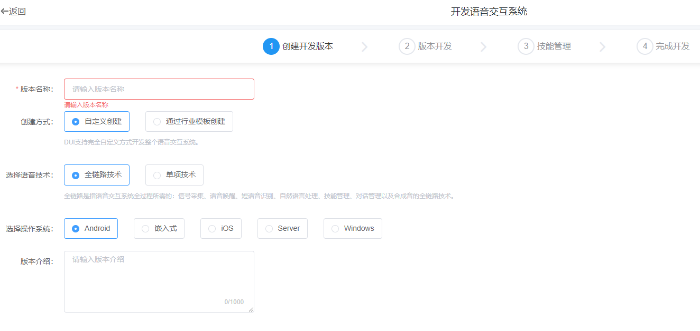 
8. Choose appropriate in next page.
9. Press "授权管理" in main menu and press "前往授权"
 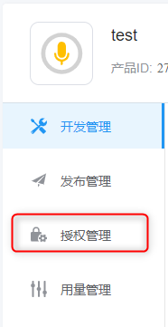 
10. Press "申请APIKEY"
 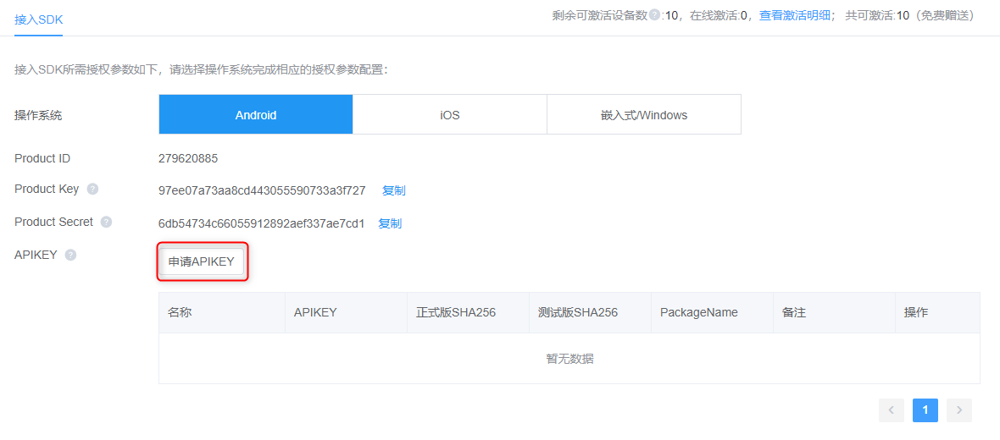 
11. Fill in the data. Get SHA256 in step12. The package name should same with the application.
The SH256 is get from signature file. So, This code need to update if you change the signture file of application.
 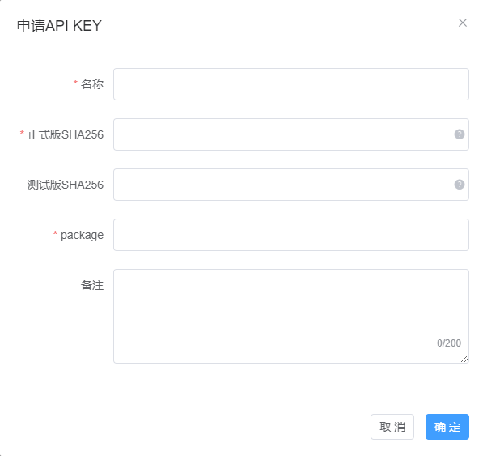 
12. Get the SHA256 in following log:
 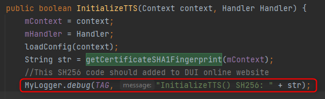 
Defined in file: Lisa\app\src\main\java\com\lihao\lisa\model\core\AISpeech\tts\AISpeechSynthesizer.java
13. Copy the ProductID, ProductKey, ProductSecret to \Lisa\app\src\main\assets\Config.properties
 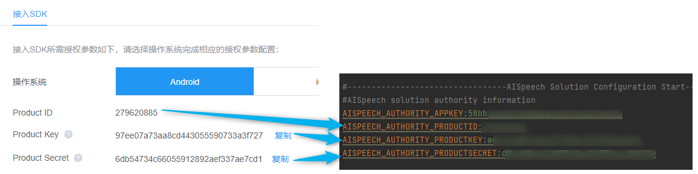 
14. Rebuild the apk and try if it works.

PS: Request AI speech offline TTS authority please refer: https://www.duiopen.com/docs/ct_localTTS_Android2
